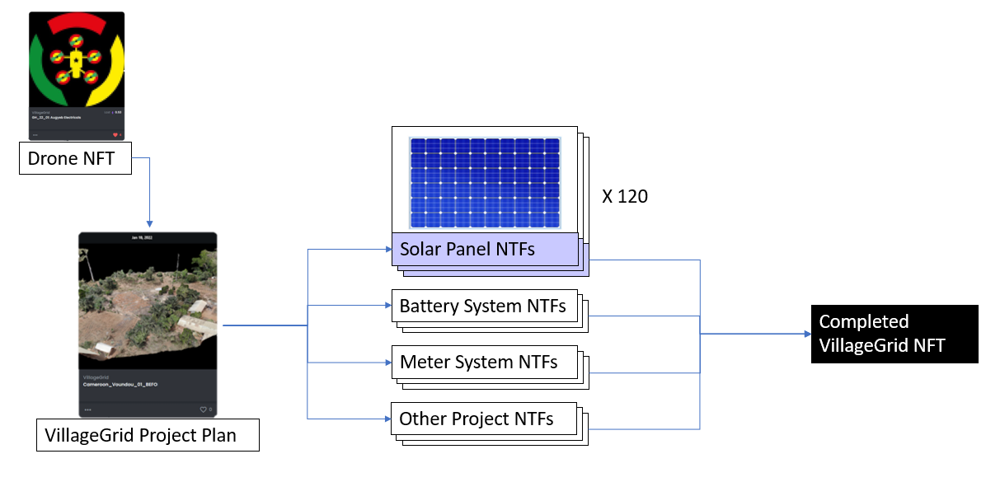

# village-grid
 
Energy, Economy, Community.  
[Discord](https://discord.gg/4DXzdBZ9)  

This is a DAO ([Decentralized Autonomous Organization](https://en.wikipedia.org/wiki/Decentralized_autonomous_organization)) dedicated on conducting experiments at blockchain and renewable energy microgrids for remote villages.  

Phase 1 (proposal): Cameroon 134 Village Experiment
Components:
- Create official Village Grid DAO
- Determine technologies to experiment with in villages (i.e. 40 villages test [Energy Web](https://www.energyweb.org/) systems, 40 test with other open-sourced projects, 40 etc.)
- [Village Grid NFT collection](https://opensea.io/collection/villagegrid) with [drones](./Drones/GH_22_01.md), [electrical projects](./ElectricalProjects/Cameroon_Voundou_01.md), and other energy/resource/utility technologies as one collection
- Organize teams for each technology type
- Open Source Knowledge sharing
- Build map to host all VillageGrid projects
- Catchy artists and content creators who help knowledge be more translatable
- Solid connection to legacy research and system operation institutions
- [Map of existing projects](https://overview-solutions.github.io/reic-projects/)

Basic idea is to capture before and after surveys of each project site using a drone (each drone has an associated NFT). 

  

[First Drone](./Drones/GH_22_01.md) 
[First Project Site (pending approval)](./ElectricalProjects/Cameroon_Voundou_01.md) 
